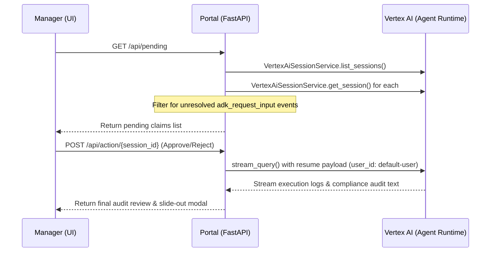

# Expense Manager Portal

A standalone, GCP-native manager dashboard service built with FastAPI, Uvicorn, and Google ADK. It provides a sleek, interactive, Glassmorphic web interface for managers to review and resolve high-value expense claims that require Human-in-the-Loop (HITL) approval.

This portal works directly in tandem with the [expense-agent](https://github.com/cphillips103/expense-agent) project.

---

## 📐 Architecture & Integration

The portal integrates directly with Google Cloud's **Vertex AI Agent Runtime** (Reasoning Engines) to inspect session state, extract pending interrupts, and resume workflows.



### FastAPI Endpoints

1. **GET `/`**:
   - Serves a premium, responsive Glassmorphic dashboard.
   - Styled with Outfit Google Fonts, radial glows, cards with backdrop blurs, loading spinners, and a slide-out compliance review modal.
2. **GET `/api/pending`**:
   - Queries the `VertexAiSessionService` to retrieve all sessions.
   - Fetches full session logs to identify unresolved `adk_request_input` function calls.
   - Extracts the warning message, timestamp, and structured expense data (`amount`, `description`, `merchant`).
3. **POST `/api/action/{session_id}`**:
   - Receives the manager's decision (Approve/Reject) and the associated `interrupt_id`.
   - Formulates the exact OIDC resume payload (with role: `user` and `parts` containing `function_response`).
   - Sets the `user_id` strictly to `"default-user"` to bypass session ownership mismatch errors.
   - Resumes the paused reasoning engine session via the GAPIC `stream_query_reasoning_engine` client and returns the agent's final compliance response.

---

## ⚙️ Configuration

The service reads the following environment variables:
* `GOOGLE_CLOUD_PROJECT`: The ID of your Google Cloud project.
* `AGENT_RUNTIME_ID`: The resource ID of your deployed Vertex AI Reasoning Engine.

---

## 🚀 Quick Start

### Local Execution

1. **Install Dependencies**:
   ```bash
   uv sync
   ```

2. **Configure Environment Variables**:
   Set the GCP project ID and your reasoning engine ID:
   ```bash
   $env:GOOGLE_CLOUD_PROJECT="<YOUR_GCP_PROJECT_ID>"
   $env:AGENT_RUNTIME_ID="<YOUR_AGENT_RUNTIME_ID>"
   ```

3. **Start the Local Server**:
   ```bash
   uv run uvicorn main:app --reload --port 8000
   ```
   Open `http://localhost:8000` to access the dashboard.

### Cloud Run Deployment

The service is containerized using the provided [Dockerfile](Dockerfile) and runs on Google Cloud Run.

To deploy it:
1. **Enable required Google APIs**:
   ```bash
   gcloud services enable run.googleapis.com artifactregistry.googleapis.com
   ```
2. **Deploy from Source**:
   ```bash
   gcloud run deploy expense-manager-dashboard \
     --source=. \
     --region=us-east1 \
     --allow-unauthenticated \
     --set-env-vars="GOOGLE_CLOUD_PROJECT=<YOUR_GCP_PROJECT_ID>,AGENT_RUNTIME_ID=<YOUR_AGENT_RUNTIME_ID>"
   ```

### IAM Permissions Reference
For the deployed service to query Vertex AI sessions, the Cloud Run service identity (e.g., Default Compute Engine Service Account) requires:
* **Vertex AI Administrator** (`roles/aiplatform.admin`) or **Vertex AI User** (`roles/aiplatform.user`) containing the `aiplatform.sessions.list` and `aiplatform.reasoningEngines.get` permissions.

